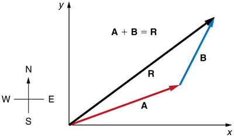

# Vectors

Broadly speaking there are 3 distinct bu related ideas of what vectors are.

1. **Physics Perspective**
    * Vectors are arrows pointing in space. What defines a given vector is its length (magnitude) and direction it points to.
    * As long as the two above remain the same you can move your vector around but it still remains the same vector.
    * Vectors living in the flat plane are 2D and those sitting in broader space are 3D.

2. **Computer Science Perspective**
    * A vector is an ordered list of numbers. For example $\enspace\begin{bmatrix}
      2\\1
    \end{bmatrix}\enspace$ represents a 2 D vector for indicating quantity you need to by to get a free item.
    >For example buy two burgers get another free one.

3. **Math Perspective**
    * This perspective seeks to generalize both these views as long as we can add or multiply these vectors.

## Note

* The top number in a vector(list) represent the x axis and the bottom number the y axis

* To distinguish vectors from points the conventions is to write vectors vertically using square brackets around them $\Large\begin{bmatrix}a\\b\end{bmatrix}$. While points are written in parenthesis. (-4, 2)

## Vector addition

Example above shows how vector addition would work.

Using mathematical notation we could represent vector addition. Lets say for instance Amani had take his friend Neema to the bus stop from home. The bus stop is 3 step North 1 step East. They find that there are no matatus there so the go on further to the next bus stop. 7 steps East then 5 steps South. Luckily they find matatus there.

How far from Amani's home did they travel. Lets us the vector notation $\begin{bmatrix} x\\y \end{bmatrix}$. x to indicate east-west movement and y to indicate north south movement.

So we know they first travelled $\begin{bmatrix} 1 \\ 3\end{bmatrix}$ then $\begin{bmatrix} 7 \\ -5\end{bmatrix}$. So in total they travel

$$\begin{bmatrix} 1 \\ 3\end{bmatrix} + \begin{bmatrix} 7 \\ -5\end{bmatrix} = \begin{bmatrix} 8 \\ -2\end{bmatrix}$$

We could say that they had to go a lot to the east and a little to the south.

If we were to plot the above the result would be a vector pointing 8 positive units to the *x axis* -2 on the *y axis*.

### Vector Addition, Subtraction & Magnitude

Suppose we have two vectors $\vec{a}$ and $\vec{b}$. We know that

>$$\vec{a} + \vec{b} = \vec{c}$$

From this we can understand that subtraction of vectors $\vec{a} - \vec{b}$ visually as
>$$\vec{a} + (-\vec{b}) = \vec{d}$$

What about the resulting magnitude of vectors $\vec{c}$ or $\vec{d}$. We can infer from pythagoras theorem that the hypotenuse is derived from the square root of the sum of square of the opposite side(height) and the adjacent side(base). i.e in a right angled triangle

>$$\|c\| =\sqrt{\|a\|^2 + \|b\|^2}$$

From this we establish that at any given time $|c|$ will never be greater than $|a|+|b|$, but can be equal to if $\vec{b}$ was an extension of $\vec{a}$ such that $\vec{b}$ was a scalar multiple of $\vec{a}$. Otherwise

>$$\|c\|\leq \|a\| + \|b\|$$

## Scalar multiplication

I like to think of this as how we scale our vectors in magnitude and direction. If the we scale our vectors in a positive direction we increase the length(magnitude) of the vector but we do not change the direction. That happens when we scale our vector with a negative scala.

For example
>$$3 \cdot \begin{bmatrix} 1 \\ 3\end{bmatrix} = \begin{bmatrix} 3 \\ 9\end{bmatrix}$$

In that the vector $\begin{bmatrix} 1 \\ 3\end{bmatrix}$ will be 3 times its value.

## Unit Vector

A Unit vector is a vector with a  magnitude of 1. So suppose we have a vector $\vec{a} = (3,5)$. We know that we can find its magnitude using the pythagoras theorem. i.e

>$$\|a\| = \sqrt{3^2 + 4^2}$$
>$$\|a\| = \sqrt{9 + 16}$$
>$$\|a\| = \sqrt{25}$$
>$$\|a\| = 5$$

So how would we derive the unit vector of $\vec{a}$ such that the magnitude is 1. Well in this case we have to scale down $\vec{a}$ by $\large\frac{1}{5}$ so that the resulting magnitude is 1.

So the unit vector $\hat{u}$ of $\vec{a}$ would be

> $$\hat{u} = (\frac{3}{\|a\|}, \frac{4}{\|a\|}) = (\frac{3}{5}, \frac{4}{5})$$

Lets verify that the magnitude of $\hat{u}$ is 1. We know that it has the components $(\large\frac{3}{5}, \large\frac{4}{5})$. Therefore

>$$\|\hat{u}\| = \sqrt{(\frac{3}{5})^2 + (\frac{4}{5})^2}$$
>$$\|\hat{u}\| = \sqrt{\frac{9}{25} + \frac{16}{25}}$$
>$$\|\hat{u}\| = \sqrt{\frac{25}{25}}$$
>$$\|\hat{u}\| = \sqrt{1}$$
>$$\|\hat{u}\| = 1$$

So for vector $\vec{a}$ with components $(x, y)$ and magnitude $\|m\| = \sqrt{x^2 + y^2}$, we derive the unit vector $\hat{u}$ as follows
>$$\hat{u} = (\frac{x}{\|m\|}, \frac{y}{\|m\|}) == (\frac{x}{\sqrt{x^2+y^2}}, \frac{y}{\sqrt{x^2+y^2}})$$